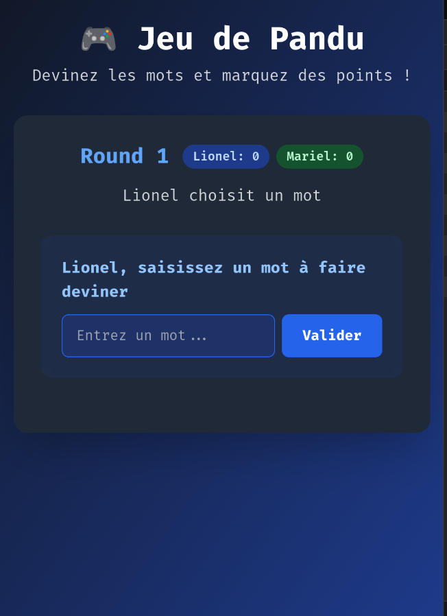
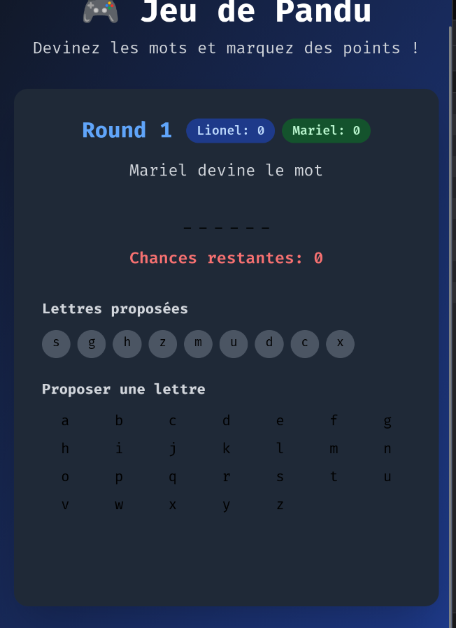

# 🎮 Jeu de Pandu

## 📋 Description du Projet
Le **Jeu de Pandu** est un jeu de devinette de mots pour deux joueurs, développé dans le cadre d'un projet universitaire. Le jeu alterne entre les tours où chaque joueur propose un mot que l'autre doit deviner en proposant des lettres.

## 👤 Auteur
- **Lionel** - Développeur principal et unique collaborateur

## 🎯 Règles du Jeu
- **2 joueurs**, **4 rounds** de base
- Chaque round = les deux joueurs jouent
- **Tour 1** : Joueur A donne un mot → Joueur B devine
- **Tour 2** : Joueur B donne un mot → Joueur A devine
- **Chances** = longueur du mot + 3
- **Égalité 2-2** après 4 rounds → round supplémentaire
- Seules les **lettres de a à z** sont autorisées

## ✅ Les Captures D'écran
<p align='center'> 
     
     
     
</p>

## 🚀 Technologies Utilisées

### Version Dart (Console)
- **Dart** ≥ 2.12.0 (Null Safety)
- Programmation orientée objet
- Gestion d'entrées/sorties console

### Version Web
- **HTML5** + **CSS3** + **JavaScript ES6**
- **Tailwind CSS** pour le styling
- Design responsive et moderne
- Interface utilisateur intuitive

## 📁 Structure du Projet

```
jeu_pandu/
│
├── pendu.dart # Version console Dart
├── pandu.html # Version web complète
├── README.md # Documentation du projet
└── assets/ # Ressources supplémentaires
└── info/ # Captures d'écran
```

## 🛠️ Installation et Exécution

### Version Dart (Console)
```bash
# Assurez-vous d'avoir Dart installé
dart --version

# Exécutez le jeu
dart pendu.dart

Version Web
bash

# Ouvrez simplement le fichier HTML dans un navigateur
open pandu.html
# ou
xdg-open pandu.html
# ou double-cliquez sur le fichier

🎮 Comment Jouer
Déroulement d'une Partie

    Démarrage : Saisie des noms des joueurs

    Round 1 :

        Joueur 1 saisit un mot secret

        Joueur 2 devine lettre par lettre

        Joueur 2 saisit un mot secret

        Joueur 1 devine lettre par lettre

    Score : Chaque mot deviné = 1 point

    Fin : Après 4 rounds, le joueur avec le plus de points gagne

Fonctionnalités

    ✅ Validation des entrées utilisateur

    ✅ Gestion des lettres déjà proposées

    ✅ Compteur de chances intelligent

    ✅ Interface visuelle attractive

    ✅ Responsive design

    ✅ Animations fluides

🔧 Classes et Architecture (Version Dart)
🏗️ Structure OOP

    Joueur : Gestion des joueurs et scores

    GestionMot : Logique de devinette et masquage

    GestionPartie : Historique et règles

    JeuPandu : Coordinateur principal du jeu

🔄 Flux du Programme

    Initialisation des joueurs

    Boucle principale sur les rounds

    Alternance des tours de jeu

    Calcul et affichage des scores

    Gestion des rounds supplémentaires

🌟 Fonctionnalités Avancées
Version Console

    Nettoyage d'écran professionnel

    Couleurs et emojis pour une meilleure UX

    Validation robuste des entrées

    Gestion d'erreur complète

Version Web

    Interface moderne avec Tailwind CSS

    Clavier virtuel interactif

    Animations CSS fluides

    Design sombre/clair

    Expérience utilisateur optimisée

📊 Logique de Jeu Améliorée
Gestion des Chances

    Les chances ne diminuent que pour les lettres incorrectes

    Les lettres déjà proposées sont ignorées sans pénalité

    Feedback immédiat pour chaque action

Validation des Entrées

    Mots : uniquement lettres, minimum 2 caractères

    Lettres : uniquement a-z, un seul caractère

    Protection contre les entrées invalides

🎨 Design et Expérience Utilisateur
Principes de Design

    Simplicité : Interface intuitive et facile à utiliser

    Accessibilité : Contraste des couleurs et taille des textes

    Responsive : Adaptation à tous les écrans

    Feedback : Retours visuels immédiats

Éléments Visuels

    Indicateurs de score en temps réel

    Animation des lettres trouvées

    Messages colorés selon le contexte

    État désactivé pour les lettres utilisées

🔮 Améliorations Futures
Fonctionnalités Potentielles

    Sauvegarde des parties

    Mode solo contre l'IA

    Thèmes personnalisables

    Tableaux des scores

    Timer pour les tours

    Sons et musique

Optimisations Techniques

    Tests unitaires complets

    Performance optimisée

    Internationalisation

    PWA (Progressive Web App)

📝 Journal de Développement
V1.0.0 - Version Initiale

    ✅ Jeu fonctionnel en Dart (console)

    ✅ Interface web complète

    ✅ Documentation détaillée

    ✅ Validation des entrées

    ✅ Gestion des scores

🤝 Contribution

Ce projet est actuellement maintenu par un seul développeur. Pour toute suggestion d'amélioration, n'hésitez pas à créer une issue ou proposer une pull request.
📄 Licence

Ce projet est développé dans un cadre éducatif. Libre utilisation pour l'apprentissage.

Développé avec ❤️ par Lionel
Projet universitaire - Jeu de Pandu